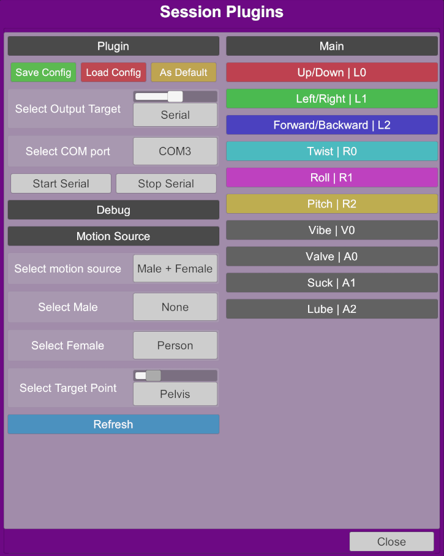
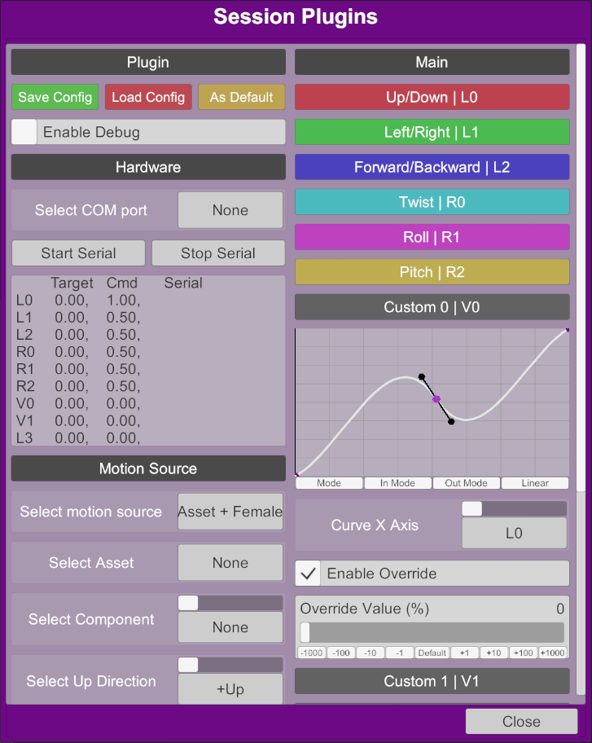

    <h1>ToySerialController</h1>
     
    
    

 

# About

ToySerialController is a VaM (Virt-a-Mate) plugin that synchronizes your [OSR](https://www.patreon.com/tempestvr) with the motion in the scene.

# Features

* Serial and UDP TCode output
* Multiple motion sources: 
    * "Male + Female"
    * "Asset + Female"
    * "Toy + Female"
    * "Animation Pattern"
* Supports TCode v0.3
* Custom curve editor for V0, A0, A1, A2